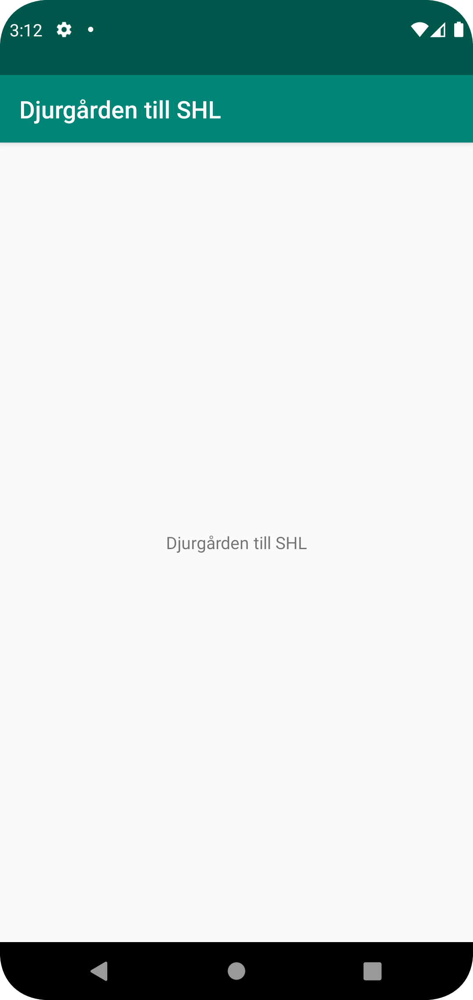

# Rapport

Målet med uppgiften var att byta namn på applikationen från "Hello" till någonting annat. Jag valde att byta appens namn till
"Djurgården mot SHL". Denna förändring gjordes i filen strings.xml. Koden ändrades från:
//"<string name="app_name">Hello</string>"
Till koden:
//"<string name="app_name">Djurgården mot SHL</string>"
Det som koden gör är att den sparar en text sträng i variabeln "app_name". Genom att ändra koden ändrades helt enkelt
den sparade text strängen vilket ändrade appens namn.
Denna skärmdump visar hur programmet såg ut efter de förändringar som tidgare beskrivits.

